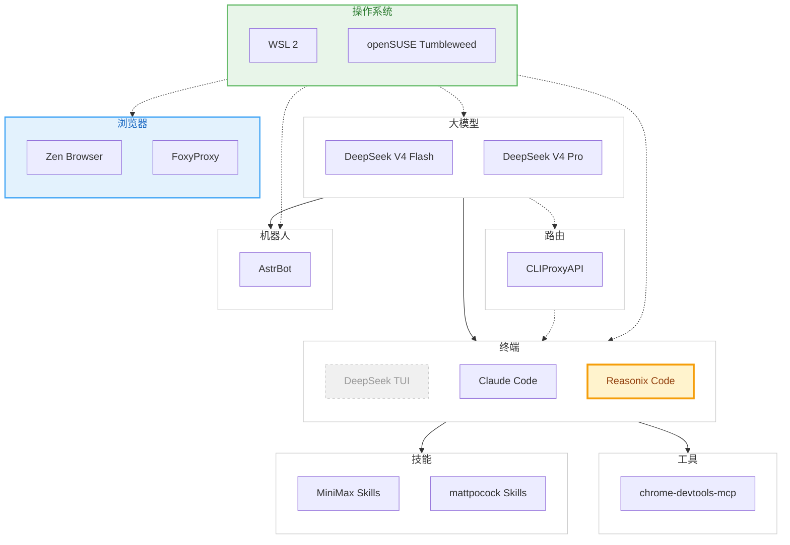

<b>AI 指令</b> — 技术链路地图维护助手（点击展开）

> 你是这个技术链路地图的维护助手。用户会告诉你用了什么工具，你负责判断它属于哪个阶段节点，更新 README 和流程图。
>
> 可用命令：
> - **添加技术栈** — 用户说「我用了 xxx」，你归类到对应节点，更新 Mermaid 流程图和 README
> - **添加阶段** — 用户说「新增一个叫 xxx 的阶段」，你创建新节点目录并接入流程图
> - **刷新地图** — 重新审查所有节点，确保流程图和内容一致

# AI Path

从 **使用 AI** 到 **每个环节能介入什么工具**，一条完整的技术链路地图。

> 只放自己用过、觉得好的东西。随着工具链进化，随时往里加。

---

## 当前链路

| 节点 | 位置 | 工具 |
|------|------|------|
| [大模型](./大模型/) | 底层 AI 能力 | **DeepSeek V4 Flash / Pro** — 性价比高，长上下文（1M tokens），Agent 模式支持好 |
| [路由](./路由/) | API 代理层 | **CLIProxyAPI** — 为终端 CLI 提供兼容 API 代理接口，支持多账号轮询负载均衡 |
| [终端](./终端/) | 交互界面 | ~~DeepSeek TUI~~ — 终端 AI 客户端，支持 Agent/MCP/Skills/RLM **Claude Code** — Anthropic 官方终端客户端，编码能力强 **⭐ Reasonix Code** — 终端编码助手，支持 Agent/Subagent/MCP/技能系统 |
| [技能](./技能/) | Agent 扩展 | **MiniMax Skills** — 工程化技能仓库 **mattpocock Skills** — 实用技能集合，含 grill-me 方案测试 |
| [工具](./工具/) | MCP 工具服务 | **chrome-devtools-mcp** — Chrome 官方 MCP 服务，让 AI 控制浏览器 DevTools |
| [机器人](./机器人/) | 机器人框架 | **AstrBot** — 聊天机器人框架，方便接入各类聊天平台 |
| [操作系统](./操作系统/) | 底层运行环境 | **WSL 2** — Windows 原生 Linux 内核 **openSUSE Tumbleweed** — 滚动发行版 Linux |
| [浏览器](./浏览器/) | 网页浏览与代理 | **Zen Browser** — 基于 Firefox 内核，隐私优先 **FoxyProxy** — 动态代理规则控制扩展 |

---

**License**: MIT
