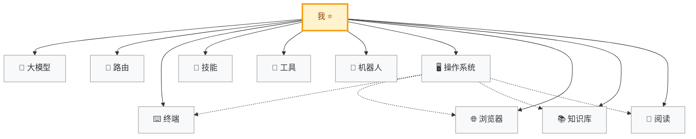

<b>AI 指令</b> — 技术链路地图维护助手（点击展开）

> 你是这个技术链路地图的维护助手。用户会告诉你用了什么工具，所有节点以 **我** 为中心连接，更新 README 和流程图。
>
> 可用命令：
> - **添加技术栈** — 用户说「我用了 xxx」，你归类到对应节点，更新 Mermaid 流程图和 README
> - **添加阶段** — 用户说「新增一个叫 xxx 的阶段」，你创建新节点目录并接入流程图
> - **刷新地图** — 重新审查所有节点，确保流程图和内容一致

# AI Path

以 **我** 为中心，连接使用的 AI 工具和技术栈。

> 只放自己用过、觉得好的东西。随着工具链进化，随时往里加。

---

## 当前链路

| 节点 | 工具 |
|------|------|
| [🤖 大模型](./大模型/) | **DeepSeek V4 Flash / Pro** — 性价比高，长上下文（1M tokens），Agent 模式支持好 |
| [🔀 路由](./路由/) | **CLIProxyAPI** — 为终端 CLI 提供兼容 API 代理接口，支持多账号轮询负载均衡 |
| [⌨️ 终端](./终端/) | **AI 终端** · Claude Code · ⭐ Reasonix Code **系统终端** · WindTerm · PowerShell |
| [🎯 技能](./技能/) | **MiniMax Skills** — 工程化技能仓库 **mattpocock Skills** — 实用技能集合 |
| [🔧 工具](./工具/) | **chrome-devtools-mcp** — Chrome 官方 MCP 服务 |
| [🤖 机器人](./机器人/) | **AstrBot** — AI 聊天机器人框架，接入大模型到多聊天平台 |
| [🖥 操作系统](./操作系统/) | **Windows** 宿主机 → **WSL 2** → **openSUSE Tumbleweed** |
| [🌐 浏览器](./浏览器/) | **Zen Browser** — 基于 Firefox 内核 ├ **FoxyProxy** — 动态代理插件 |
| [📚 知识库](./知识库/) | **Logseq** — 本地优先知识管理，GitHub 仓库同步 |
| [📰 阅读](./阅读/) | **Folo** — 现代化 RSS 阅读器 |

---

**License**: MIT
