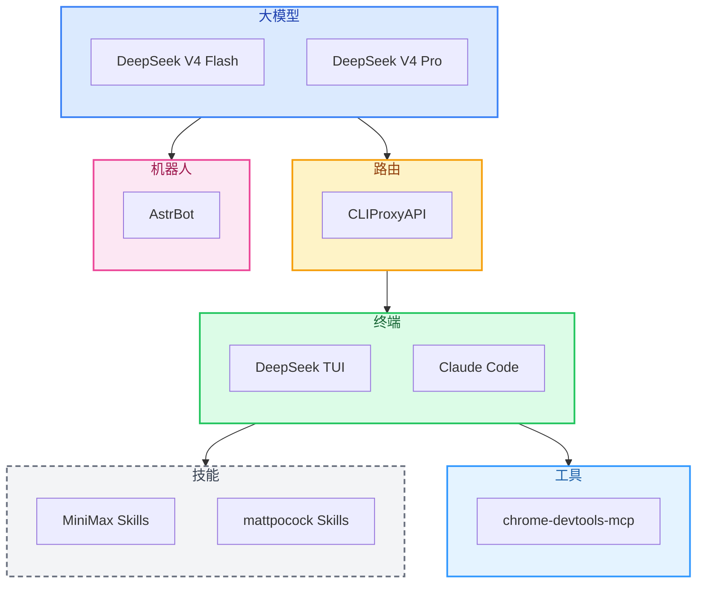

<b>AI 指令</b> — 技术链路地图维护助手（点击展开）

> 你是这个技术链路地图的维护助手。用户会告诉你用了什么工具，你负责判断它属于哪个阶段节点，更新 README 和流程图。
>
> 可用命令：
> - **添加技术栈** — 用户说「我用了 xxx」，你归类到对应节点，更新 Mermaid 流程图和 README
> - **添加阶段** — 用户说「新增一个叫 xxx 的阶段」，你创建新节点目录并接入流程图
> - **刷新地图** — 重新审查所有节点，确保流程图和内容一致

# AI Path

从 **使用 AI** 到 **每个环节能介入什么工具**，一条完整的技术链路地图。

> 只放自己用过、觉得好的东西。随着工具链进化，随时往里加。

---

## 当前链路

| 节点 | 位置 | 工具 |
|------|------|------|
| [大模型](./大模型/) | 底层 AI 能力 | DeepSeek V4 Flash / Pro |
| [路由](./路由/) | API 代理层 | CLIProxyAPI |
| [终端](./终端/) | 交互界面 | DeepSeek TUI · Claude Code |
| [技能](./技能/) | Agent 扩展 | MiniMax Skills · mattpocock Skills |
| [工具](./工具/) | MCP 工具服务 | chrome-devtools-mcp |
| [机器人](./机器人/) | 机器人框架 | AstrBot |

---

**License**: MIT
