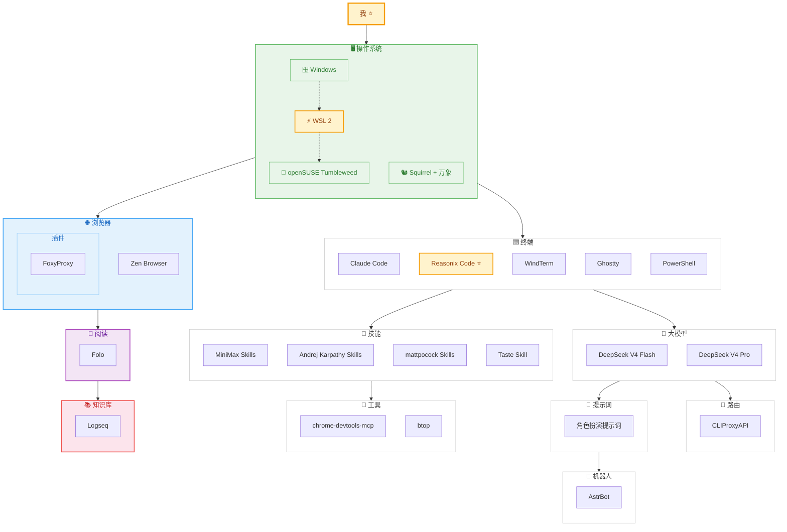

<b>AI 指令</b> — 技术链路地图维护助手（点击展开）

> 你是这个技术链路地图的维护助手。用户会告诉你用了什么工具，你负责判断它属于哪个阶段节点，更新 README 和流程图。
>
> 可用命令：
> - **添加技术栈** — 用户说「我用了 xxx」，你归类到对应节点，更新 Mermaid 流程图和 README
> - **添加阶段** — 用户说「新增一个叫 xxx 的阶段」，你创建新节点目录并接入流程图
> - **刷新地图** — 重新审查所有节点，确保流程图和内容一致

# AI Path

从 **使用 AI** 到 **每个环节能介入什么工具**，一条完整的技术链路地图。

> 只放自己用过、觉得好的东西。随着工具链进化，随时往里加。

---

## 当前链路

| 节点 | 工具 |
|------|------|
| [🖥 操作系统](./操作系统/) | 🪟 **Windows** 宿主机 → ⚡ **WSL 2** → 🐧 **openSUSE Tumbleweed** ⌨️ 🐿️ **[Squirrel（鼠须管）](https://github.com/rime/squirrel)** + 🌐 **[万象](https://github.com/amzxyz/RIME-LMDG)** — Rime 拼音输入方案 |
| [⌨️ 终端](./终端/) | Claude Code · ⭐ Reasonix Code · [WindTerm](https://github.com/kingToolbox/WindTerm) · [Ghostty](https://github.com/ghostty-org/ghostty) · [PowerShell](https://github.com/PowerShell/PowerShell) |
| [🤖 大模型](./大模型/) | **DeepSeek V4 Flash / Pro** — 长上下文，Agent 友好 |
| [💬 提示词](./提示词/) | **角色扮演提示词** — 私人全能助理设定，针对 DeepSeek 等模型优化 |
| [🔀 路由](./路由/) | **[CLIProxyAPI](https://github.com/router-for-me/CLIProxyAPI)** — 多账号轮询负载均衡 |
| [🎯 技能](./技能/) | [MiniMax Skills](https://github.com/MiniMax-AI/skills) · [Andrej Karpathy Skills](https://github.com/multica-ai/andrej-karpathy-skills) · [mattpocock Skills](https://github.com/mattpocock/skills) · [Taste Skill](https://github.com/Leonxlnx/taste-skill) |
| [🔧 工具](./工具/) | **[chrome-devtools-mcp](https://github.com/ChromeDevTools/chrome-devtools-mcp)** — Chrome DevTools 控制 **[btop](https://github.com/aristocratos/btop)** — 终端资源监控，替代 htop |
| [🤖 机器人](./机器人/) | **[AstrBot](https://github.com/AstrBotDevs/AstrBot)** — AI 聊天机器人，多平台接入 |
| [🌐 浏览器](./浏览器/) | **Zen Browser** + [FoxyProxy](https://github.com/foxyproxy/foxyproxy) 动态代理 |
| [📚 知识库](./知识库/) | **[Logseq](https://github.com/logseq/logseq)** — 双向链接，GitHub 同步 |
| [📰 阅读](./阅读/) | **[Folo](https://github.com/RSSNext/Folo)** — 现代化 RSS 阅读器 |

---

**License**: MIT
